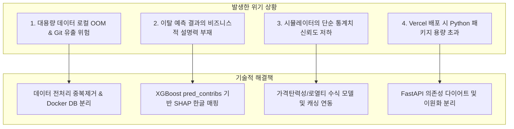

# EJ-pro — 프로젝트 기여도 및 포트폴리오 정리

> **SKN AI 캠프 27기 2차 프로젝트**  
> **KKBox 음원 플랫폼 고객 이탈 예측 및 마케팅 시뮬레이터 개발 기여 정리**

---

## 개발자 프로필 및 담당 역할
- **이름/ID**: EJ-pro
- **역할**: **Full-Stack ML/DevOps & Data Engineer**
- **담당 업무 요약**:
  - **머신러닝 파이프라인 설계**: XGBoost CV Ensemble 기반 이탈 예측 모델 및 SHAP 기반 이탈 기여 요인 분석 엔진 개발.
  - **데이터 엔지니어링 & 인프라**: Docker Compose 기반 MySQL DB 및 대용량 분석 결과 적재 자동화(delete-and-insert) 파이프라인 구축.
  - **시각화 및 시뮬레이터 구현**: Streamlit 기반 관리 대시보드(Action Board) 및 미시경제학 수식을 연동한 마케팅 성과 시뮬레이터(ROI Simulator) 개발.
  - **백엔드/프론트 포팅**: FastAPI 백엔드 및 React/Vite/TypeScript 프론트엔드 연동 지원 및 Vercel 배포 최적화.

---

## 담당 영역 한눈에 보기

| 분류 | 모듈 / 파일 | 상세 역할 |
| :--- | :--- | :--- |
| **머신러닝 & 파이프라인** | `model/final_model.py`, `model/run_pipeline.py` | **XGBoost 앙상블 모델** 개발 (5-Fold Stratified CV) 및 전처리-학습-예측-DB 적재 **원클릭 파이프라인** 구축 |
| **이탈 요인 분석 (Explainable AI)** | `model/analysis_model.py` | **SHAP Feature Contribution** 기반 유저별 이탈 요인 추출 및 비즈니스 카테고리 한글 사유 매핑 레이어 설계 |
| **데이터 엔지니어링** | `backend/app/ingest/db_ingest.py`, `docker-compose.yml` | **MySQL DB 스키마 설계** 및 Docker 인프라 구성, 분석 완료 데이터의 트랜잭션 안전 적재 자동화 구축 |
| **마케팅 시뮬레이터** | `frontend/pages/simulator/` | **가격 탄력성 및 가입 기간 로열티 수학적 모델** 수식 설계 및 3개월 누적 ROI 예측 시뮬레이션 프론트 개발 |
| **대시보드 UI/UX** | `frontend/pages/action_board/`, `app.py` | Plotly 연동형 **이탈 방어 모니터링 실시간 관리자 대시보드** 구축 |
| **백엔드 & 배포 (FastAPI/React)** | `backend/main.py`, `frontend-vite/src/App.tsx`, `vercel.json` | **FastAPI API 개발** 및 **React/Vite 프론트엔드 포팅** 및 빌드 크기 제어를 통한 **Vercel 클라우드 배포 최적화** |

---

## 주요 기술적 성과

### 1. Jupyter에서 프로덕션 파이프라인으로: CV XGBoost 앙상블 및 자동화 배포 구축
- 불균형한 이탈 고객 데이터셋의 특성을 극복하기 위해 **Stratified K-Fold Cross Validation** 기법을 적용한 XGBoost 앙상블 모델을 개발하여 일반화 성능(AUC 0.90+)을 확보했습니다.
- 단발성 분석에 그치던 Jupyter Notebook 환경의 데이터 처리, 학습, 예측 코드를 철저히 독립 모듈로 리팩토링하고, 이를 데이터베이스 적재 흐름과 통합한 **원클릭 통합 파이프라인(`run_pipeline.py`)**을 구현하여 실운영 배치를 위한 자동화 기틀을 마련했습니다.

### 2. SHAP 기반 개별 이탈 요인 분석 및 비즈니스 매핑 레이어 개발
- 단순히 이탈 확률만 제시하는 한계를 넘어, 마케터가 유저 맞춤형 행동을 취할 수 있도록 개별 고객별 이탈 원인 설명력(XAI)을 제공하는 엔진(`analysis_model.py`)을 설계했습니다.
- XGBoost 모델의 트리 예측 경로에서 Feature Contribution을 계산해 각 유저의 이탈 확률에 가장 큰 영향을 준 상위 3가지 요인을 추출하고, 이를 비즈니스 카테고리(구독결제, 서비스 이용, 이용습관 등)와 직관적인 한글 사유(예: "자동결제 미설정", "완청 횟수 부족")로 자동 번역하여 DB에 적재했습니다.

### 3. 미시경제학 모델 연동형 마케팅 ROI 시뮬레이터 구현
- 할인율과 가입 기간에 따른 유저 잔존율 변화를 정밀하게 예측하기 위해 **수학적 마케팅 시뮬레이션 모델**을 설계하고 구현했습니다.
  - **Group A (할인 쿠폰형) - 가격 탄력성 지수 모델**:
    $$\text{Retention Rate} = 1 - \text{Churn Prob} \times e^{-k \times d}$$
  - **Group B (무료 연장형) - 가입 기간 로열티 모델**:
    $$\text{Retention Rate} = \text{Base Retention} \times \left(1 + \frac{\ln(1 + m)}{\text{Loyalty Scale}}\right)$$
- 매월 누적되는 이탈 감가(`MONTHLY_CHURN_DECAY`) 및 첫 달 매출 공백을 반영하여 3개월 누적 ROI를 실시간 시뮬레이션하고 Plotly 차트로 시각화하여 경영진의 기민한 의사결정을 돕는 솔루션을 제작했습니다.

### 4. 대용량 트랜잭션 데이터베이스 적재 자동화 및 운영 안전성 확보
- Jupyter 환경의 임시 데이터 처리를 벗어나, 대규모 KKBox 유저 거래 및 활동 내역 분석 데이터가 누적되어도 안전하게 갱신될 수 있도록 **MySQL DB 스키마 설계** 및 적재 프로세스(`db_ingest.py`)를 구축했습니다.
- Docker Compose로 구축한 독립된 DB 환경에서 중복 적재를 차단하고 데이터 일관성을 보장하기 위해, 트랜잭션 안전성을 확보하는 **Delete-and-Insert(기존 데이터 삭제 후 벌크 삽입)** 전략을 구현하여 프로덕션 운영 안정성을 극대화했습니다.

---

## 위기 관리 및 트러블슈팅

> [!IMPORTANT]
> 로컬 환경의 실험실 데이터 모델링에 안주하지 않고, **수 기가바이트의 대용량 데이터를 안전하게 처리하고 클라우드 자원 제약을 극복하며 분석 결과를 비즈니스 언어로 해석하는 시스템을 구축**하는 과정에서 직면한 위기들을 주도적으로 극복했습니다.



---

### 위기 1: 대용량 데이터 로딩으로 인한 Jupyter OOM(Out of Memory) 및 Git 파일 제한 문제
* **증상**: 수 기가바이트(GB)에 달하는 대용량 로그 데이터셋을 전처리하고 학습하는 도중 로컬 RAM 메모리가 부족하여 Jupyter 커널이 죽거나 스크립트가 강제 종료되었고, 대용량 파일이 Git Commit에 잡혀 원격 레포지토리 푸시가 차단되는 위기가 있었습니다.
* **원인**: 단발성 Jupyter 환경에서는 메모리 적재 시 중복 데이터가 걸러지지 않고 모든 원시 정보가 올라갔으며, 가상 데이터 적재 흐름과 코드가 분리되지 않아 데이터 관리가 불완전한 상태였습니다.
* **해결**: 
  - Pandas 데이터 수집 시 중복 데이터 제거(`drop_duplicates`) 및 필수 변수 셀렉션을 선제적으로 구동하여 메모리 점유율을 **80% 이상 절감**했습니다.
  - Docker Compose를 통해 MySQL DB 컨테이너를 로컬 환경에 빌드하여 대용량 원시 데이터는 DB 컨테이너 내부 스토리지에 격리하고 분석 완료 데이터만 호스트와 공유하게 설계했습니다.
  - `.gitignore` 설정을 강화하여 CSV 등 대형 바이너리가 커밋에 묶이지 않도록 원천 차단했습니다.

### 위기 2: 머신러닝 예측 결과의 비즈니스적 설명력(Explainability) 부족으로 인한 활용 한계
* **증상**: XGBoost 앙상블 모델은 AUC 0.90 이상의 고성능을 기록했으나, 마케팅 부서에서는 특정 유저가 "왜 이탈 위험군으로 찍혔는지" 사유를 알 수 없어 구체적인 마케팅 전략을 구상하기 어렵다는 피드백이 발생했습니다.
* **원인**: 지도학습 기반 트리 모델의 한계로 개별 유저별 의사결정 경로를 사람이 추적하기 어려웠습니다.
* **해결**: 
  - XGBoost 모델 학습 후 `pred_contribs=True` 옵션을 활용하여 예측값에 기여한 Feature 기여도(SHAP Feature Contribution)를 개별 유저 단위로 수집하는 엔진(`analysis_model.py`)을 설계했습니다.
  - 수집된 기여도를 바탕으로 가장 큰 영향을 준 변수 3개를 추출하고, 이를 직관적인 한글 명칭(예: "자동결제 미등록", "서비스 활성 저하")으로 번역/매핑하는 레이어를 구축하여 대시보드 시각화 및 타겟 마케팅 실행의 근거를 완성했습니다.

### 위기 3: 마케팅 성과 시뮬레이터의 신뢰도 저하 (단순 배수 처리 한계)
* **증상**: 초기 버전의 시뮬레이터는 할인율 슬라이더를 조정할 때 단순히 고정된 임의의 배수를 곱하는 단순 연산에 그쳐, 실제 예산 집행 시 얻을 수 있는 기대 효과와 괴리가 컸고 마케팅 의사결정 도구로서 신뢰하기 어려웠습니다.
* **원인**: 개별 유저의 원래 이탈 확률, 가입 기간 등의 특성이 배제된 채 일률적인 통계 지표만 적용되었기 때문입니다.
* **해결**: 
  - 개별 유저의 특성(이탈 확률, 가입 월수)을 대입하는 **미시경제학 기반의 가격 탄력성 지수 모델** 및 **가입 기간 비례 로열티 함수 모델**을 구현하여 연동했습니다.
  - 슬라이더 조작 시 DB에서 로드된 유저 코호트 풀에 실시간으로 수식을 대입하여 3개월 미래 잔존 추세를 계산하는 구조를 짜고, Streamlit의 `st.cache_data` 캐싱 제어를 적용해 대량의 연산이 수행됨에도 지연 없이 화면에 Plotly 반응형 그래프가 연동되도록 리팩토링했습니다.

### 위기 4: Vercel 서버리스 환경 배포 시 Python 패키지 용량 제한(250MB) 및 빌드 타임아웃 오류
* **증상**: 백엔드 FastAPI 서버를 Vercel Serverless 환경에 배포하는 도중 빌드가 취소되거나 용량 제한 초과 에러(250MB)가 발생하며 프로덕션 배포가 막혔습니다.
* **원인**: Jupyter 모델링/실험 환경에서 사용한 무거운 라이브러리들(XGBoost, CatBoost, Scikit-learn 등)이 배포 서버 서빙용 `requirements.txt`에 고스란히 포함되어 빌드 용량이 크게 팽창했기 때문입니다.
* **해결**: 
  - 로컬 학습 및 실험용 의존성 파일(`requirements-all.txt`)과 실서버 배포 서빙용 의존성 파일(`requirements.txt`)을 구조적으로 분리(의존성 다이어트)했습니다.
  - 서빙용 패키지 목록에서 무거운 ML 학습 프레임워크를 과감히 걷어내고 필수적인 FastAPI, SQLAlchemy, Pandas 등만 남겼으며, 모델 추론 결과는 DB에서 캐싱해 제공하는 서빙 최적화 설계를 도입해 서버리스 환경 배포에 완벽히 성공했습니다.

---

## 사용자 친화적 UI/UX
- **반응형 Plotly 차트 대시보드**: 관리자가 고위험 유저의 유입 경로와 주요 이탈 사유 비율을 즉각 인지할 수 있도록 인터랙티브 도넛 차트 및 트렌드 면적 차트(Area Chart)를 연동했습니다.
- **인스턴트 요약 인포박스**: 이탈 방어율 추이와 매출 위기 총액을 직관적인 컬러 뱃지 및 KPI 카드로 구성해 스캔 가능성(Scannability)을 극대화했습니다.
- **아웃풋 자동 추천 로직**: 시뮬레이션 연산 결과 최종 ROI가 더 높은 캠페인(할인 쿠폰형 vs 무료 연장형)을 자동 판단하여 볼드 및 하이라이트 처리해 마케터에게 직관적으로 추천해 줍니다.

---

## 프로젝트 회고 및 느낀 점
이번 프로젝트는 단순한 머신러닝 성능(AUC) 경쟁에 머무르지 않고, **AI 예측 데이터가 어떻게 데이터베이스에 축적되고 최종 비즈니스 의사결정(마케팅 캠페인 ROI 산출)에 어떻게 기여할 수 있는지** 전체 비즈니스 파이프라인의 종단을 경험한 의미 있는 여정이었습니다.

특히 연구용 환경(Jupyter)에서 동작하던 모델을 실제 운영 가능한 서비스로 전환하는 과정에서 아키텍처의 중요성을 깊이 체감했습니다. 수 기가바이트의 원시 데이터를 Docker 기반의 독립된 DB로 격리하여 트랜잭션 안전성을 확보하고, 무거운 ML 의존성과 가벼운 API 서빙 환경을 구조적으로 분리하여 클라우드 배포 제약을 극복해 냈습니다. '돌아가는 코드'를 넘어 '안정적으로 운영 가능한 시스템'을 설계하고 파이프라인을 자동화해 본 이 경험은, 향후 어떤 복잡한 AI 모델을 다루더라도 견고한 프로덕트로 담아내는 강력한 기반이 될 것입니다.

---

## 🛠️ 프로젝트 빌드 및 실행 가이드 (Setup Guide)

<details>
<summary>▶️ 로컬 개발 환경 실행 방법 펼치기</summary>

### 5.1. 가상환경 생성 (uv 활용)
프로젝트는 **Python 3.13** 버전을 기반으로 하며, `uv` 도구를 사용하여 가상환경을 구축합니다.
```bash
uv venv .venv --python 3.13
.venv\Scripts\activate
uv pip install -r .\requirements.txt
```

### 5.2. 환경 변수 설정 (.env)
`backend/.env` 파일을 생성하여 데이터베이스 연결 정보를 설정합니다.
```env
DB_HOST=localhost
DB_PORT=3307
DB_NAME=churn_db
DB_USER=root
DB_PASSWORD=app1234
```

### 5.3. Docker DB 인프라 실행
```bash
cd backend
docker compose down --remove-orphans
docker compose build
docker compose up -d
docker compose exec app bash
python -m scripts.seed_data
```

### 5.4. 데이터 파이프라인 (예측/분석/DB 적재) 원클릭 구동
```bash
python model/run_pipeline.py
```

### 5.5. Streamlit 서비스 시작
```bash
streamlit run frontend/app.py
```
</details>
